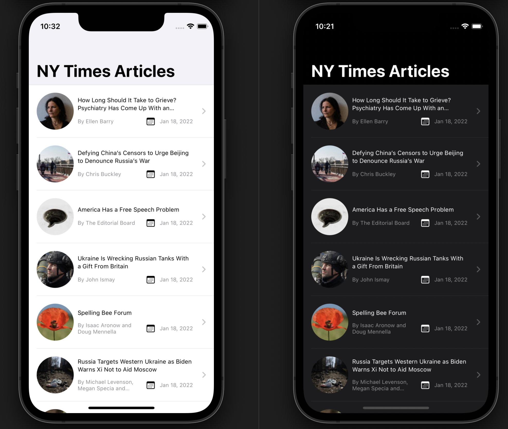
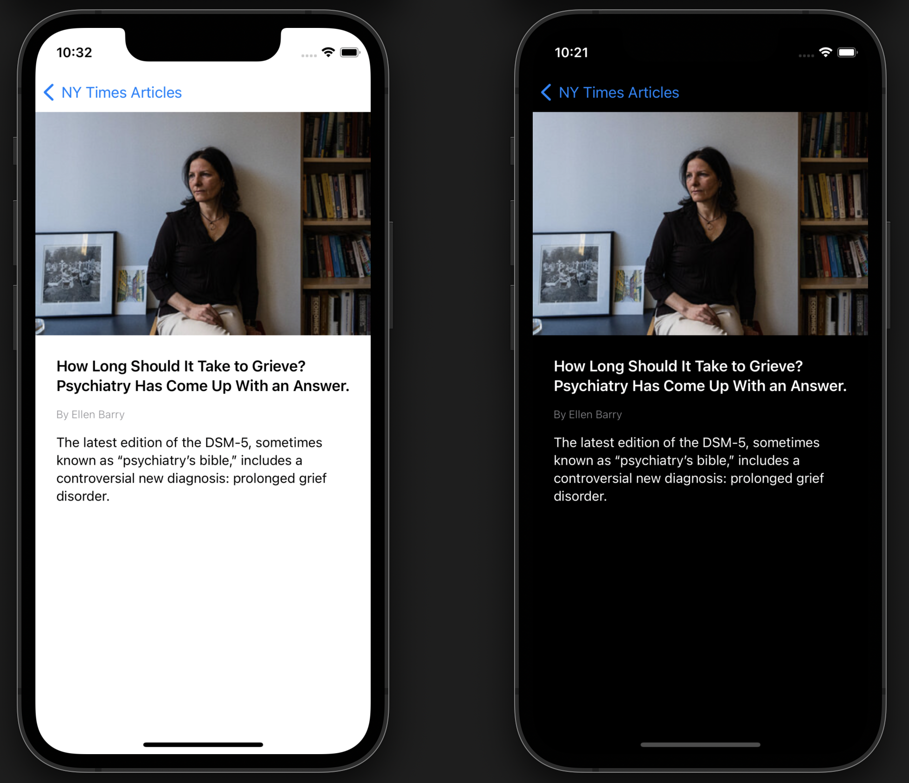
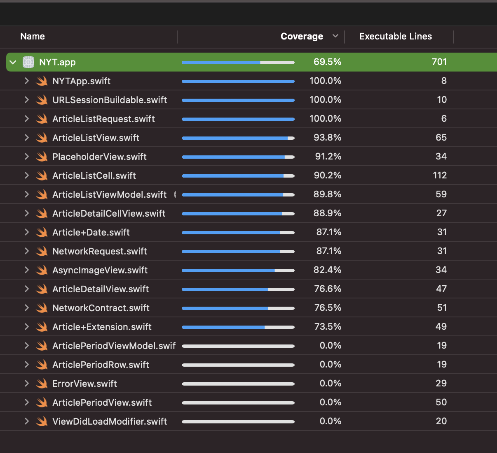

# NYT
NYT-SwiftUI

## Version
1.0

# Media

## Build and Runtime Requirements
+ Xcode 13.2 or later
+ iOS 15.2 or later

## Summary

This app demonstrates the use of New York Times api to get most popular articles and displaying with a rich user experience.
 
## Technical Stack

- Swift UI for Designing the UI
- XCTests for Unit & UI Tests
- No External library/framework used.

## Highlights

- The app is build with SwiftUI
- App dynamically adapts to different screen sizes i.e. works on iPhone, iPad, & iPod Touch 
- Overall, all business logic is covered with Unit & UITests
- Executed the full suite for the required UI section of the app with XCUITest frame (video attached)
- Supports Dark Mode as well
- Code Coverage upto 70 %

# Code Coverage

